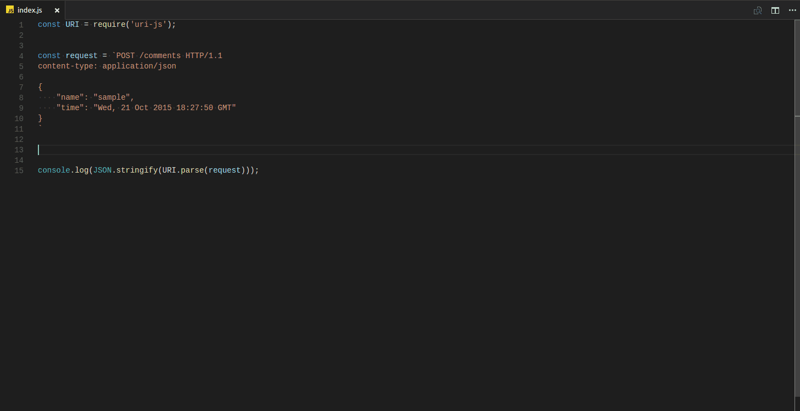

# ES-Query

Lets you run queries against ElasticSearch in the same format they show up in the
ElasticSearch documentation.


## Please note this extention has been abandoned in favor of a new extention that has been authored by ria.
```
ext install elastic
```


## Features
> Simply select text in your current document and either right-click "Execute ElasticSearch Query"
or use the hotkey `ctrl/cmd + shift + e`

```
GET _cat/indices
```

```
POST /messages/inbox
{
  "from": "bob",
  "message": "Hello World!"
}
```



## Extension Settings

This extension contributes the following settings:

* `esQuery.execute`: Execute selected text as query
* `esQuery.setHost`: Set/Change ElasticSearch host (workspace setting)

## Known Issues

## Release Notes

### 0.0.6

* fixed query string bug
* error message handling enhancement by ([YusukeHosonuma] (https://github.com/jitcoder/es-query/pull/7)) 

### 0.0.5

* Added query information to results pane  ([Reported Issue](https://github.com/jitcoder/es-query/issues/1))

### 0.0.1

Initial Release

## Upcoming Features

* Multi-line selected text
* Autocomplete/Intellisense
* Query validation